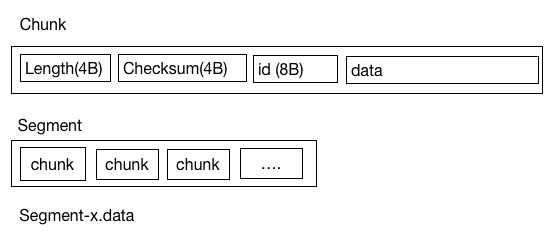
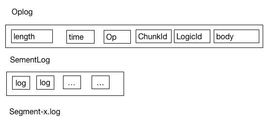

# kiteq-common

migrate from github.com/blackbeans/kiteq.git 

### Store-File

Filestore is include two part, segment and log.

The data struct of segment is below:

The data struct of segment log is below:

  

